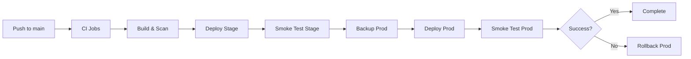

# CI/CD Pipeline Documentation

## Pipeline Overview

## Job Responsibilities

### CI Jobs

| Job | Responsibility | Trigger | Failure Impact |
|-----|---------------|---------|----------------|
| `lint` | Lint & Contract Check: Runs ESLint, checks API contract compliance | All pushes/PRs | Blocks pipeline |
| `typecheck` | Type Check: Runs TypeScript type checking | All pushes/PRs | Blocks pipeline |
| `unit-tests` | Unit Tests: Runs unit tests for web and server apps | All pushes/PRs | Blocks pipeline |
| `integration-tests` | Integration Tests: Runs integration tests for web and server | All pushes/PRs | Blocks pipeline |
| `security-scan` | Security Scan: Runs npm audit, Snyk, and Trivy scans | All pushes/PRs | Blocks pipeline |

### Build Job

| Job | Responsibility | Trigger | Failure Impact |
|-----|---------------|---------|----------------|
| `build` | Build Docker Images: Builds and pushes web/server images to ECR, scans for vulnerabilities | After all CI jobs pass | Blocks deployment |

### Stage Deployment Jobs

| Job | Responsibility | Trigger | Failure Impact |
|-----|---------------|---------|----------------|
| `deploy-stage` | Deploy to Stage: Updates ECS services in test environment, waits for stability | Main branch only | Blocks production deployment |
| `smoke-test-stage` | Smoke Test (Stage): Runs health checks and API endpoint tests against stage environment | After stage deployment | Blocks production deployment |

### Production Deployment Jobs

| Job | Responsibility | Trigger | Failure Impact |
|-----|---------------|---------|----------------|
| `backup-prod` | Backup Production Database: Creates RDS snapshot, verifies completion | After stage smoke tests pass | Blocks production deployment |
| `deploy-prod` | Deploy to Production: Updates ECS services in prod environment (requires manual approval) | After backup completes | Triggers rollback |
| `smoke-test-prod` | Smoke Test (Production): Runs health checks against production environment | After prod deployment | Triggers rollback |
| `rollback-prod` | Rollback Production: Reverts to previous ECS task definition if deployment fails | On deployment failure | Restores previous version |

## Environment Protection Rules

### Stage Environment
- **Required Reviewers**: None (auto-deploy)
- **Deployment Branches**: main only
- **Wait Timer**: 0 minutes

### Production Environment
- **Required Reviewers**: 2 team members
- **Deployment Branches**: main only
- **Wait Timer**: 0 minutes
- **Pre-deployment**: Automatic RDS backup

## Secrets Required

| Secret | Purpose | Used By |
|--------|---------|---------|
| `AWS_ACCESS_KEY_ID` | AWS authentication | All AWS jobs |
| `AWS_SECRET_ACCESS_KEY` | AWS authentication | All AWS jobs |
| `SNYK_TOKEN` | Snyk security scanning | security-scan job |

## Failure Handling

### CI Failures
- All CI jobs must pass before proceeding to build
- Test results are uploaded as artifacts for debugging

### Deployment Failures
- Stage deployment failures block production deployment
- Production deployment failures trigger automatic rollback
- Rollback job reverts to previous task definition revision

### Security Scan Failures
- Critical/High vulnerabilities block the pipeline
- Medium/Low vulnerabilities are reported but don't block

## Monitoring and Notifications

### Success Notifications
- Not implemented in this draft (consider adding Slack/Teams integration)

### Failure Notifications
- Rollback completion includes notification step
- Consider adding PagerDuty/OpsGenie integration for production failures

## Performance Considerations

### Caching
- pnpm cache is used for dependency installation
- Docker layer caching should be configured in build steps

### Parallelization
- CI jobs run in parallel where possible
- Build job waits for all CI jobs to complete

## Security Best Practices

### Least Privilege
- AWS credentials should have minimal required permissions
- ECR push permissions only for build job
- ECS update permissions only for deployment jobs

### Image Security
- All images are scanned for vulnerabilities before deployment
- Critical vulnerabilities block deployment

### Secret Management
- All secrets are stored in GitHub Secrets
- No secrets are exposed in logs

## Maintenance

### Regular Updates
- Update Node.js and pnpm versions regularly
- Update GitHub Actions versions quarterly
- Review and update AWS permissions quarterly

### Documentation
- Keep this README updated with any pipeline changes
- Document any custom scripts or procedures