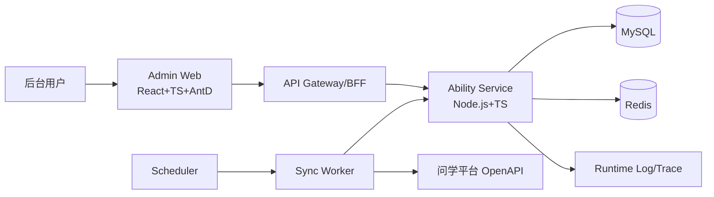
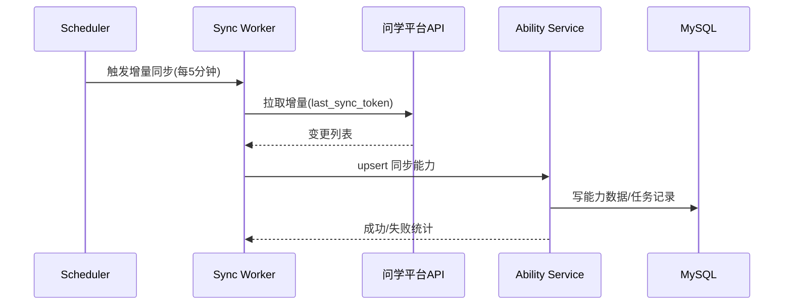

# TECH_SPEC.md

## 1. 文档信息

1. 项目：能力管理板块（后台）
2. 技术栈：前端 React + TypeScript + Ant Design（方案1）；后端 Node.js + TypeScript
3. 版本：v1.4
4. 范围：仅能力管理（不含智能体管理）
5. 不做项：前台智能体展示、智能体上线/下线流程、服务内 RBAC 校验

## 2. 目标

1. 分类管理：增删改查、排序、唯一性校验
2. 能力管理：列表、筛选、新增、编辑、查看、软删除
3. 问学同步：增量同步 + 全量校准
4. 外部能力：HTTP 请求配置与校验
5. 工程保障：并发一致性、可观测、可自动化验收

## 3. 架构图

### 3.1 逻辑架构



### 3.2 同步主流程



## 4. 模块设计

### 4.1 前端模块（React + TS + Ant Design）

1. 分类管理：分类列表、新增、编辑、删除
2. 能力列表：分页、名称模糊、功能类型筛选
3. 能力编辑：基础信息、请求配置、同步能力只读
4. 请求配置：method/url/header/query/body/timeout
5. UI组件层（Ant Design）：
   - 表格与分页：`Table` + `Pagination`
   - 表单：`Form` + `Input` + `Select` + `InputNumber`
   - 弹层：`Modal` + `Drawer`
   - 上传：`Upload`
   - 提示反馈：`Message` + `Notification`
6. 通用能力：API SDK、错误码映射、加载/空态/冲突态

### 4.2 后端模块（Node.js + TS）

1. Category 模块：Controller/Service/Repository
2. Capability 模块：Controller/Service/Repository
3. HTTP 配置校验：URL、安全网段、超时、Header 黑名单
4. Sync 模块：增量/全量、重试、冲突覆盖、任务记录
5. 并发控制：乐观锁（version）
6. 错误处理：统一错误码和响应结构

### 4.3 任务调度

1. 增量：每 5 分钟
2. 全量：每日 02:00
3. 重试：最多 3 次，1s/2s/4s

## 5. 数据模型

### 5.1 `categories`

| 字段                  | 类型             | 说明                    |
| --------------------- | ---------------- | ----------------------- |
| id                    | bigint           | PK                      |
| name                  | varchar(32)      | 分类名                  |
| normalized_name       | varchar(32)      | 归一化名（去空格+小写） |
| sort                  | int              | 排序值                  |
| is_builtin            | tinyint          | 内置分类标记            |
| is_deleted            | tinyint          | 软删标记                |
| created_by/created_at | varchar/datetime | 创建信息                |
| updated_by/updated_at | varchar/datetime | 更新信息                |
| version               | int              | 乐观锁                  |

约束：

1. `uk_cat_name(normalized_name,is_deleted)`
2. `name/normalized_name/sort/is_builtin/is_deleted/version/created_by/created_at/updated_by/updated_at` 全部 `NOT NULL`

### 5.2 `capabilities`

| 字段                  | 类型             | 说明                            |
| --------------------- | ---------------- | ------------------------------- |
| id                    | bigint           | PK                              |
| capability_name       | varchar(32)      | 能力名（业务限制10字符）        |
| normalized_name       | varchar(32)      | 归一化名                        |
| capability_type       | enum             | WX_APP/WX_FLOW/EXT_APP/EXT_FLOW |
| category_id           | bigint           | 分类ID                          |
| source                | enum             | sync/manual                     |
| external_id           | varchar(64)      | 同步来源ID                      |
| intro                 | varchar(64)      | 简介（业务限制10字符）          |
| is_deleted            | tinyint          | 软删标记                        |
| created_by/created_at | varchar/datetime | 创建信息                        |
| updated_by/updated_at | varchar/datetime | 更新信息                        |
| version               | int              | 乐观锁                          |

约束：

1. `uk_cap_name(category_id,normalized_name,is_deleted)`
2. `uk_sync(external_id,capability_type,is_deleted)`
3. `category_id` 外键：`FK capabilities.category_id -> categories.id ON UPDATE CASCADE ON DELETE RESTRICT`
4. `id/capability_name/normalized_name/capability_type/category_id/source/is_deleted/version/created_by/created_at/updated_by/updated_at` 全部 `NOT NULL`

### 5.3 `capability_http_configs`

| 字段                              | 类型          | 说明                           |
| --------------------------------- | ------------- | ------------------------------ |
| capability_id                     | bigint        | 能力ID（唯一）                 |
| method                            | enum          | GET/POST/HEAD/PATCH/PUT/DELETE |
| url                               | varchar(1024) | 请求地址                       |
| headers_json/query_json/body_json | json          | 请求参数                       |
| body_type                         | enum          | none/json/form-urlencoded/raw  |
| connect/read/write_timeout_ms     | int           | 1000-60000                     |
| created_at/updated_at             | datetime      | 时间戳                         |

约束：

1. `capability_id` 唯一约束
2. `capability_id` 外键：`FK capability_http_configs.capability_id -> capabilities.id ON UPDATE CASCADE ON DELETE RESTRICT`
3. `capability_id/method/url/body_type/connect_timeout_ms/read_timeout_ms/write_timeout_ms/created_at/updated_at` 全部 `NOT NULL`

### 5.4 `sync_jobs`

| 字段                     | 类型         | 说明                           |
| ------------------------ | ------------ | ------------------------------ |
| id                       | bigint       | PK                             |
| job_type                 | enum         | incremental/full               |
| status                   | enum         | running/success/failed/partial |
| started_at/ended_at      | datetime     | 执行窗口                       |
| success_count/fail_count | int          | 结果计数                       |
| error_summary            | text         | 失败摘要                       |
| cursor_token             | varchar(256) | 增量游标                       |

约束：

1. `id/job_type/status/started_at/success_count/fail_count` 为 `NOT NULL`

## 6. API 定义

### 6.1 统一约定

1. Base Path：`/api/v1/ability-management`
2. 认证：沿用网关登录态
3. 业务数值参数统一 `number-string`（纯数字字符串，允许前导零）
4. `number-string` 正则：`^[0-9]+$`
5. 分页：`page`、`page_size`（number-string；page>=1；page_size 1-100）

响应格式：

```json
{ "code": "0", "message": "ok", "data": {}, "request_id": "xxx" }
```

```json
{ "code": "CAP_4001", "message": "参数不合法", "request_id": "xxx" }
```

### 6.2 分类接口

| 接口               | 方法   | 说明     |
| ------------------ | ------ | -------- |
| `/categories`      | GET    | 分类列表 |
| `/categories`      | POST   | 新增分类 |
| `/categories/{id}` | PUT    | 更新分类 |
| `/categories/{id}` | DELETE | 删除分类 |

关键字段：

1. POST：`name`(string), `sort`(number-string)
2. PUT：`name`(string), `sort`(number-string), `version`(number-string)
3. DELETE：`id` 为 number-string

### 6.3 能力接口

| 接口                 | 方法   | 说明               |
| -------------------- | ------ | ------------------ |
| `/capabilities`      | GET    | 列表（筛选+分页）  |
| `/capabilities/{id}` | GET    | 详情               |
| `/capabilities`      | POST   | 新增（仅外部类型） |
| `/capabilities/{id}` | PUT    | 更新               |
| `/capabilities/{id}` | DELETE | 软删除             |

筛选参数：

1. `keyword`（能力名称）
2. `capability_type`（功能类型）

关键字段：

1. `capability_name`(string)
2. `capability_type`(enum)
3. `category_id`(number-string)
4. `intro`(string)
5. `request_config`(object)
6. `version`(number-string, 更新必填)

### 6.4 同步接口

| 接口                 | 方法 | 说明         |
| -------------------- | ---- | ------------ |
| `/sync-jobs`         | GET  | 同步任务记录 |
| `/sync-jobs/trigger` | POST | 手动触发同步 |

规则：手动触发同步时，不允许并发运行多个任务。

### 6.5 错误码

1. `CAP_4001` 参数错误
2. `CAP_4002` 名称重复
3. `CAP_4003` 资源不存在
4. `CAP_4004` 同步能力只读
5. `CAP_4005` 分类非空不可删
6. `CAP_4006` URL 不允许
7. `CAP_4091` 并发冲突
8. `CAP_5001` 外部调用异常
9. `CAP_5002` 同步任务异常

### 6.6 HTTP Status 与业务码映射

| 业务码     | HTTP Status | 说明               |
| ---------- | ----------- | ------------------ |
| `0`        | 200         | 成功               |
| `CAP_4001` | 400         | 参数校验失败       |
| `CAP_4002` | 409         | 资源唯一性冲突     |
| `CAP_4003` | 404         | 资源不存在         |
| `CAP_4004` | 409         | 只读资源不可修改   |
| `CAP_4005` | 409         | 删除前置条件不满足 |
| `CAP_4006` | 400         | URL/请求配置非法   |
| `CAP_4091` | 409         | 乐观锁/并发冲突    |
| `CAP_5001` | 502         | 外部依赖调用失败   |
| `CAP_5002` | 500         | 系统内部任务失败   |

## 7. 边界条件处理

### 7.1 通用输入

| 场景                        | 处理            | 返回码   |
| --------------------------- | --------------- | -------- |
| 名称为空/全空格             | trim 后校验失败 | CAP_4001 |
| 名称超长                    | 拒绝保存        | CAP_4001 |
| 重名（忽略大小写+空格折叠） | 唯一约束失败    | CAP_4002 |
| number-string 含非数字      | 拒绝保存        | CAP_4001 |
| page_size > 100             | 拒绝返回        | CAP_4001 |

### 7.2 分类

| 场景         | 处理       | 返回码   |
| ------------ | ---------- | -------- |
| 删除内置分类 | 拒绝       | CAP_4001 |
| 删除非空分类 | 阻断删除   | CAP_4005 |
| 分类不存在   | 返回不存在 | CAP_4003 |

### 7.3 能力

| 场景              | 处理                           | 返回码   |
| ----------------- | ------------------------------ | -------- |
| 新增问学类型能力  | 不允许                         | CAP_4001 |
| 编辑/删除同步能力 | 不允许                         | CAP_4004 |
| 修改能力类型      | 清空 `request_config` 后再保存 | 0        |
| 重复删除          | 幂等处理（统一成功）           | 0        |

### 7.4 HTTP 配置

| 场景                          | 处理           | 返回码   |
| ----------------------------- | -------------- | -------- |
| URL 非 http/https             | 拒绝           | CAP_4006 |
| 内网/回环地址                 | 拒绝           | CAP_4006 |
| 超时不在 1-60s                | 拒绝           | CAP_4001 |
| Header 含 Host/Content-Length | 拒绝           | CAP_4001 |
| 响应体 > 2MB                  | 失败并记录日志 | CAP_5001 |

### 7.5 并发与同步

| 场景                           | 处理                       | 返回码   |
| ------------------------------ | -------------------------- | -------- |
| 并发更新同一记录               | version 冲突               | CAP_4091 |
| 手动触发同步时已有任务 running | 拒绝触发                   | CAP_4091 |
| 同步与人工编辑冲突             | 同步字段覆盖并记录任务告警 | 0        |
| 同步任务部分失败               | 标记 partial + 失败明细    | CAP_5002 |

## 8. 非功能、可维护性与发布

1. 性能：10,000 条能力数据，列表查询 P95 < 500ms
2. 可用性：月可用性 >= 99.9%
3. 安全：敏感字段加密存储，日志脱敏
4. 可观测：接口/同步任务输出 trace_id、耗时、错误码
5. 自动化：P0 验收项全部可自动化验证
6. 常量配置化：重试次数、退避间隔、超时阈值、响应体大小阈值均配置化
7. 能力类型扩展策略：新增 `capability_type` 时遵循“后端枚举+前端映射表+默认兜底显示”，保持向后兼容
8. UI 一致性：前端默认使用 Ant Design 组件与主题 Token，新增页面优先复用 antd 组件
9. 发布：灰度 10% -> 50% -> 100%，异常按版本与任务开关回滚

## 9. 评审修改项与原因

| 修改项   | 修改内容                                                                                                    | 修改原因                                                       | 影响范围                       |
| -------- | ----------------------------------------------------------------------------------------------------------- | -------------------------------------------------------------- | ------------------------------ |
| API-01   | 明确 `number-string` 允许前导零，并补充正则 `^[0-9]+$`                                                      | 消除前后端对数值字符串解析口径不一致，避免联调和自动化用例歧义 | 参数校验、接口契约、自动化测试 |
| API-02   | 增加“业务码 -> HTTP Status”映射表                                                                           | 统一网关、前端、测试脚本对错误语义的处理，避免同码不同状态     | 所有 API 响应处理链路          |
| DATA-01  | 为 `capabilities.category_id` 与 `capability_http_configs.capability_id` 增加外键及 `ON UPDATE/DELETE` 策略 | 防止孤儿数据，保证分类/能力/配置之间引用完整性                 | 数据库约束、删除与更新行为     |
| DATA-02  | 为核心字段补充 `NOT NULL` 约束清单                                                                          | 将业务必填约束下沉到数据库层，降低脏数据风险                   | 数据库写入与迁移脚本           |
| ERR-01   | 拆分 `CAP_5001` 为 `CAP_5001`（外部调用异常）与 `CAP_5002`（同步任务异常）                                  | 细化故障归因，便于告警路由、排障与测试断言                     | 错误处理、监控告警、自动化断言 |
| RULE-01  | 删除接口幂等返回统一成功码 `0`                                                                              | 避免重复删除在客户端被误判为失败，提升接口幂等一致性           | 删除接口与回归测试             |
| RULE-02  | 明确手动触发同步不允许并发运行多个任务                                                                      | 防止重复同步、数据覆盖竞争、任务资源争抢                       | 同步触发接口与任务调度         |
| MAINT-01 | 增加“常量配置化”要求（重试、退避、超时、响应体阈值）                                                        | 降低硬编码成本，支持按环境调整策略而不改代码                   | 配置管理、运维发布             |
| MAINT-02 | 增加 `capability_type` 扩展策略（后端枚举+前端映射+默认兜底）                                               | 保证新增类型时兼容旧版本，减少前后端联动风险                   | 枚举扩展、前后端兼容           |
| UI-01    | 确定前端 UI 组件库为 Ant Design（方案1）                                                                    | 降低组件选型分歧，提升中后台交付效率与一致性                   | 前端实现、UI规范、组件复用     |

## 10. Monorepo 工程目录结构（简化）

> 目标：一眼看清前后端常用工程项位置。

```text
AgentSetting/
  docs/
    TECH_SPEC.md
    learning/

  apps/
    web/                      # 前端 React + TS + AntD
      src/
        pages/
        components/
        services/
        types/
        utils/
      tests/
      package.json

    server/                   # 后端 Node.js + TS
      src/
        modules/              # capability/category/sync
        common/               # middleware/validator/utils
        config/
        db/
      db/
        migrations/           # 数据库迁移脚本
      tests/
      package.json

  packages/                   # 前后端共享
    shared-types/
    shared-utils/

  .github/
    workflows/
      ci.yml                  # CI/CD 流水线

  docker/
  docker-compose.yml          # 本地 MySQL/Redis 等基础依赖

  scripts/
  .gitignore
  package.json
  pnpm-workspace.yaml
  turbo.json
  CLAUDE.md
```
