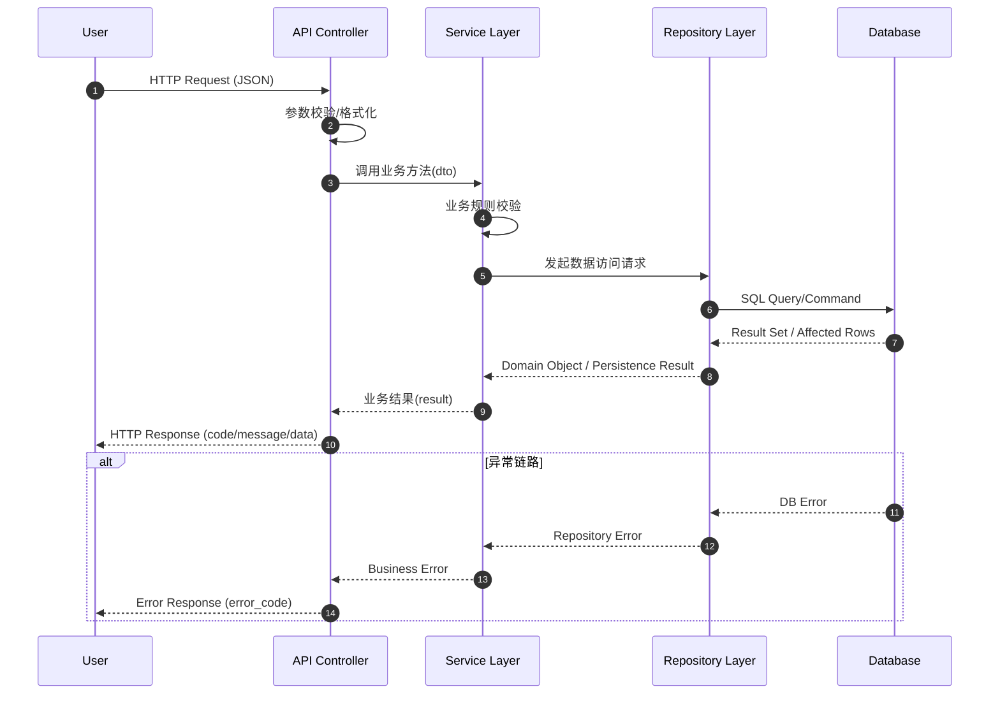
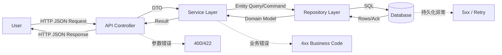

# 系统数据流图（User -> API -> Service -> Repository -> Database）

```mermaid
sequenceDiagram
  autonumber
  participant U as User
  participant API as API Controller
  participant SVC as Service Layer
  participant REP as Repository Layer
  participant DB as Database

  U->>API: HTTP Request (JSON)
  API->>API: 参数校验/格式化
  API->>SVC: 调用业务方法(dto)
  SVC->>SVC: 业务规则校验
  SVC->>REP: 发起数据访问请求
  REP->>DB: SQL Query/Command
  DB-->>REP: Result Set / Affected Rows
  REP-->>SVC: Domain Object / Persistence Result
  SVC-->>API: 业务结果(result)
  API-->>U: HTTP Response (code/message/data)

  alt 异常链路
    DB-->>REP: DB Error
    REP-->>SVC: Repository Error
    SVC-->>API: Business Error
    API-->>U: Error Response (error_code)
  end
```

```mermaid
flowchart LR
  U[User] -->|HTTP JSON Request| API[API Controller]
  API -->|DTO| SVC[Service Layer]
  SVC -->|Entity Query/Command| REP[Repository Layer]
  REP -->|SQL| DB[(Database)]

  DB -->|Rows/Ack| REP
  REP -->|Domain Model| SVC
  SVC -->|Result| API
  API -->|HTTP JSON Response| U

  API -.参数错误.-> E1[400/422]
  SVC -.业务错误.-> E2[4xx Business Code]
  DB -.持久化异常.-> E3[5xx / Retry]
```
